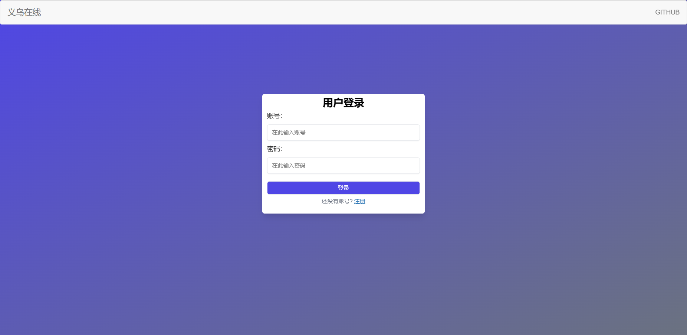
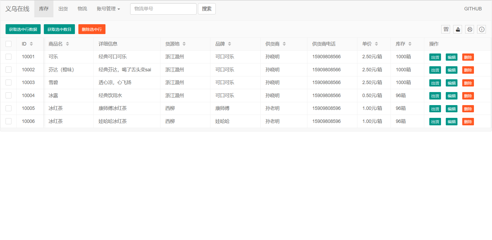

# YiwuOnline
### 义乌在线

登录界面

库存管理界面

##### 简述

- 一个简单的SpringBoot后台管理项目
- 有账号登录、注册、登陆状态验证等功能
- 实现库存、出货、物流信息管理
- 就是增、删、改、查
- 支持表格打印、多条信息管理，复制
- 支持快捷按物流信息查询

##### 使用技术

- 前端：jQuery，Bootstrap，Layui
- 后端：Spring，SpringBoot，MyBatis，Swagger2，Thymeleaf，Hutool

##### 本地复现

1. 使用maven导入依赖
2. 使用ide运行项目

By：tyza66(洮羱芝闇)